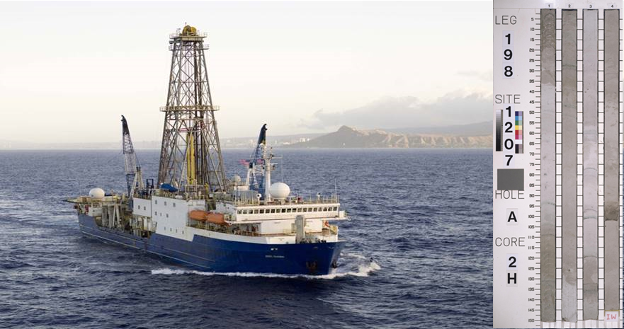

```{r setup, include=FALSE}
knitr::opts_chunk$set(echo = TRUE)
library(readxl)
library(tidyverse)
```

### Sediment core sampling

Ocean drilling programs sample sediments from the ocean floor to collect data that can be used for a wide range of analyses, such as climate change research. These programs use drill ships to extract long sections of sediment cores.


Image: Drill ship and sediment core (image copyright IODP)


A maximum of 9 metres of core can be drilled in one go. This example is the second core at a hole (i.e. 2H refers to 9-18 m). Each 9 m is then split into approximately 1.5 metre sections for easy handling. The first four of these sections are shown here.

### Age-depth data

Deeper sediments are typically older. Using fossil plankton, it is possible to calculate the age (in millions of years) of different depths in the core

```{r age-depth data, echo = FALSE}
# load the data
hole <- "872C"
age_depth <- read_excel("Data/Age depth profiles.xlsx", sheet = hole)

# Plot the age / depth profile
with(age_depth, plot(AgeW11GTS12, InterpolatedDepth_mbsf, ylim = c(max(InterpolatedDepth_mbsf, na.rm = TRUE), 0), main = hole, pch = 16, col = factor(Type), las = 1, bty = "l", xlab = "Age / Ma", ylab = "Depth / mbsf"))
legend("topright", levels(factor(age_depth$Type)), pch = 16, col = 1:2, bty = "n")

```

## Calculate the sample depths

In this project, I had a set of samples, which were defined based on the core section they were taken from. I wanted to calculate the age of the samples, but to do so I first had to calculate their absolute depth within the core.

I have the sample data which includes details of the core, section, and depth within the section:

```{r sample data, echo = FALSE}
iodp.samples <- read_excel("Data/Sampling Request.xlsx", sheet = "SAMPLE_TABLE", col_types = c("text", rep("numeric", 2), rep("text", 5), rep("numeric", 3), "text", rep("numeric", 4), rep("text", 6)))
iodp.samples

```

And details of the length of each section in the entire hole:

```{r section info, echo = FALSE}
# details of core 
load("Data/iodp_core_summary.RData")
select(iodp.core.summary, -c(Date, Time))

```

**The challenge is to use the information on the length of each section to calculate the depth of the sample below the sea floor**

```{r depth calculation}
# write a recursive function for calculating depths
recur_depth <- function(x, data) {
  # take in one row of the dataframe
  if (x["Section"] == "CC") { # if core catcher then subtract width of core catcher from the bottom of the core depth
    return(as.numeric(x["Bottom_mbsf"]) - as.numeric(x["Length_rs_m"]))
  }
  else if (x["Section"] == "1") { # if the first section, then return the top depth
    return(as.numeric(x["Top_mbsf"]))
  } else {
    # use recursion and add on the depth of the previous section
    recur_depth(data[data$Hole == as.character(x["Hole"]) & data$Core_no == as.character(x["Core_no"]) & data$Section == (as.numeric(x["Section"]) - 1), ], data) + data$Length_rs_m[data$Hole == as.character(x["Hole"]) & data$Core_no == as.character(x["Core_no"]) & data$Section == (as.numeric(x["Section"]) - 1)]
  }
}

# check this works
tmp <- iodp.core.summary[iodp.core.summary$Core_no == "1H",]
apply(tmp, 1, recur_depth, tmp)
tmp

# run the function on the full core
iodp.core.summary$Section_depth_mbsf <- apply(iodp.core.summary, 1, recur_depth, iodp.core.summary)

```

By merging these two dataframes (the sample data and the core summary), and then adding the exact depth within the section, the depth of each sample can be obtained.

```{r combine datasets}
# merge the samples with the depth dataset
iodp.samples <- left_join(iodp.samples, iodp.core.summary, by = c("Hole" = "Hole", "Core" = "Core_no", "Section" = "Section"))

# calculate depths of the samples
iodp.samples$Top_sample_depth <- iodp.samples$Section_depth_mbsf + iodp.samples$`Top Interval (cm)`/100
iodp.samples$Bottom_sample_depth <- iodp.samples$Section_depth_mbsf + iodp.samples$`Bottom Interval (cm)`/100 
iodp.samples$mean_sample_depth <- apply(iodp.samples[, c("Top_sample_depth", "Bottom_sample_depth")], 1, mean)

# sense check this by plotting
plot(iodp.samples$Top_sample_depth)
```

### Calculate ages using a linear regression

```{r calulate ages}
# focussing on the top 40m of the core
age_depth_40 <- age_depth[age_depth$InterpolatedDepth_mbsf <= 40, ] 
with(age_depth_40, plot(AgeW11GTS12~ InterpolatedDepth_mbsf, main = hole, pch = 16, las = 1, bty = "l", ylab = "Age / Ma", xlab = "Depth / mbsf"))

# calculate sedimentation rate
# model the relationship with a linear model forcing it to go through the origin
sed.rate <- lm(AgeW11GTS12 ~ InterpolatedDepth_mbsf - 1, data = age_depth_40)
abline(sed.rate, col = 4, lwd = 2)

# get the age estimates for the samples < 40m
iodp.samples$Age_Ma <- NA
iodp.samples$Age_Ma[iodp.samples$mean_sample_depth < 40] <- predict(sed.rate, newdata = data.frame(InterpolatedDepth_mbsf = iodp.samples$mean_sample_depth[iodp.samples$mean_sample_depth < 40]))

points(iodp.samples$mean_sample_depth, iodp.samples$Age_Ma, col = "red", pch = 16)
```
